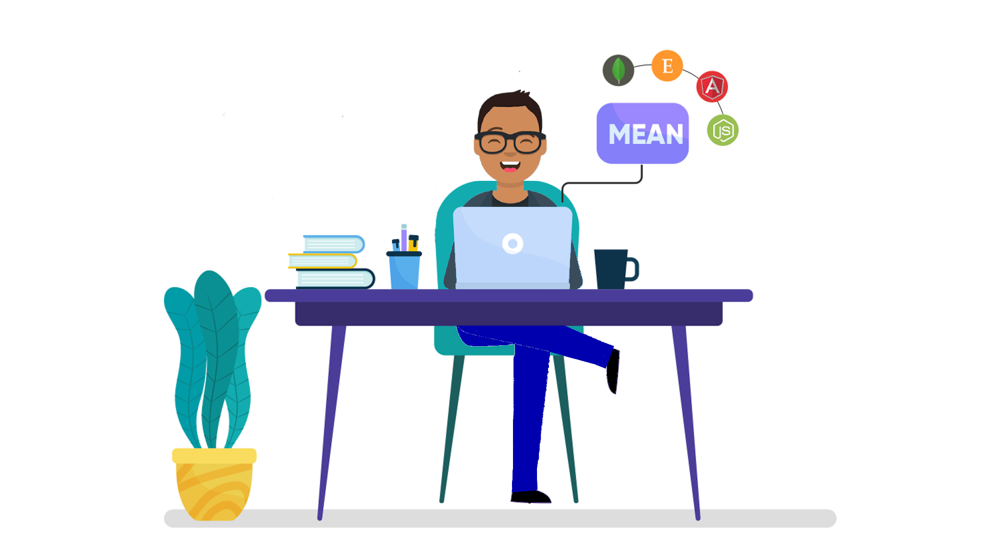

# Portafolio de Desarrollador

Mi portafolio plantilla

## Autor

[@CarlosReges](https://www.twitter.com/carlosreges)

## Github repo

Este es [enlace](https://github.com/Ksound22/developer-portfolio) del repositorio para hacer el portafolio

## Sitio web

Una demo en vivo está disponible en este [enlace](https://eager-williams-af0d00.netlify.app/?)

## Tecnologías utilizadas

**Client:** HTML, CSS, JavaScript, Bootstrap

## Herramientas usadas

Herramientas utilizadas para generar las imágenes:

- [Ion Icons](https://ionic.io/ionicons) menú hamburguesa.
- [Drawkit](https://www.drawkit.io/) ilustración y luego editada por mí.
- [Icon8](https://icons8.com/) para iconos animados.
- [Animate CSS](https://animate.style/) para la animación del texto.
- [Formspree](https://formspree.io/) para formulario de contactos.

## Estructura de las carpetas

Los archivos index.html y readme están en la carpeta inicial.

La carpeta assets contiene los archivos CSS y JavaScript, todas las imágenes e iconos utilizados, en sus respectivas carpetas.